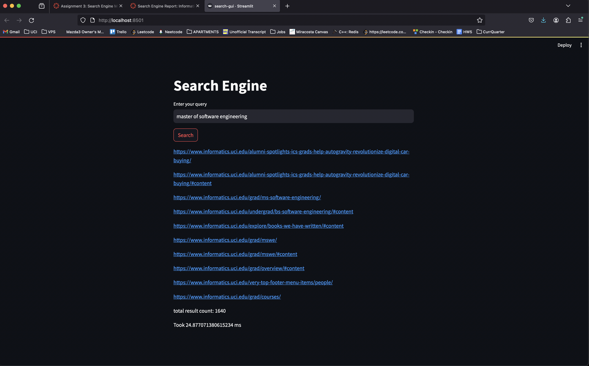

Welcome to my UCI search engine!

indexer.py:
    - this file was used to create 3 separate indexes that covered the entirety of corpus.
    creates 3 index pickle files for serialization
    Run this file with the DEV/ folder in the working directory and it will create 3 pickled indexes
    

serializer.py:
    - takes index pickle files and writes the postings for each term to a file in the format: 
        term:docID,tf-idf;\n

    - also creates the jump maps for each index file to be able to jump to a term's line and read all the postings in O(1) time

    - must be edited to accept different file names for each pickled index 1, 2, and 3
    

search.py:
    - program for use of search in terminal
    - run this program and you will be prompted to type in a query, it will return the top 10 highest rated tf-idf documents from the intersection of the given terms

search-gui.py:
    - program using streamlit to use search engine with Web GUI

